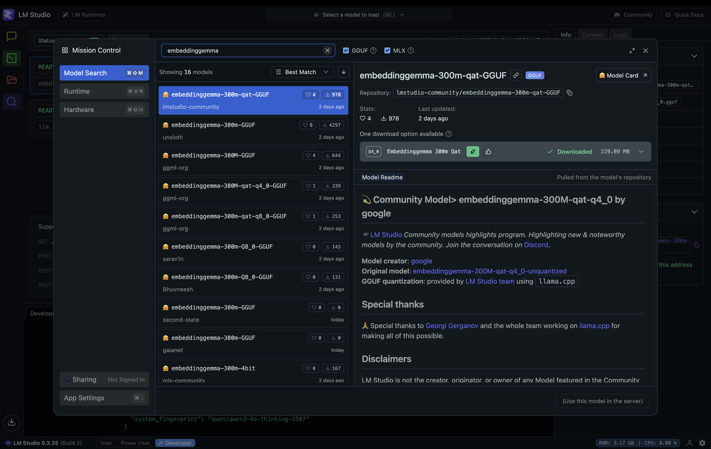
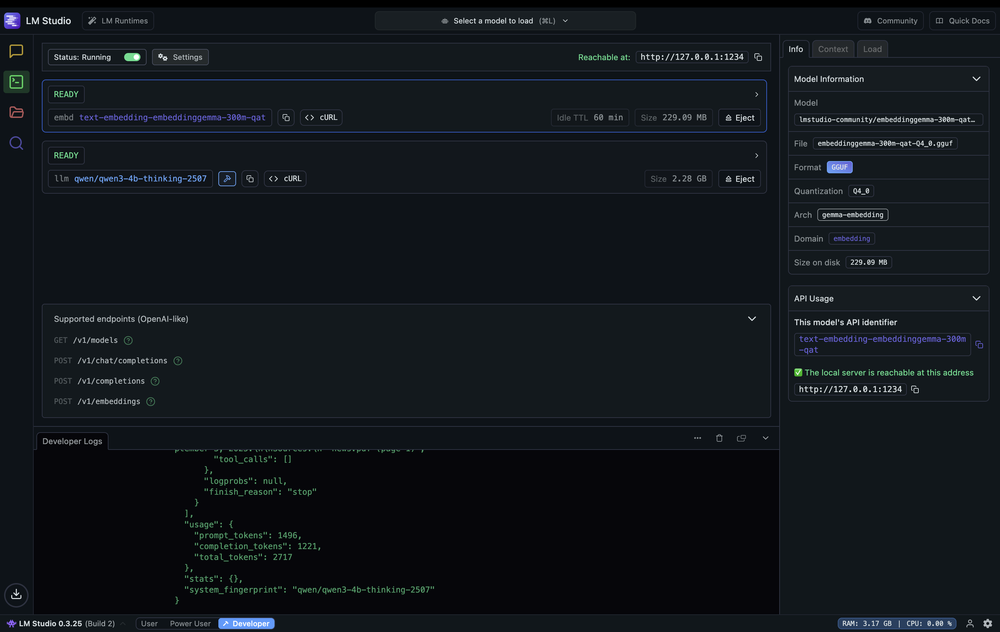
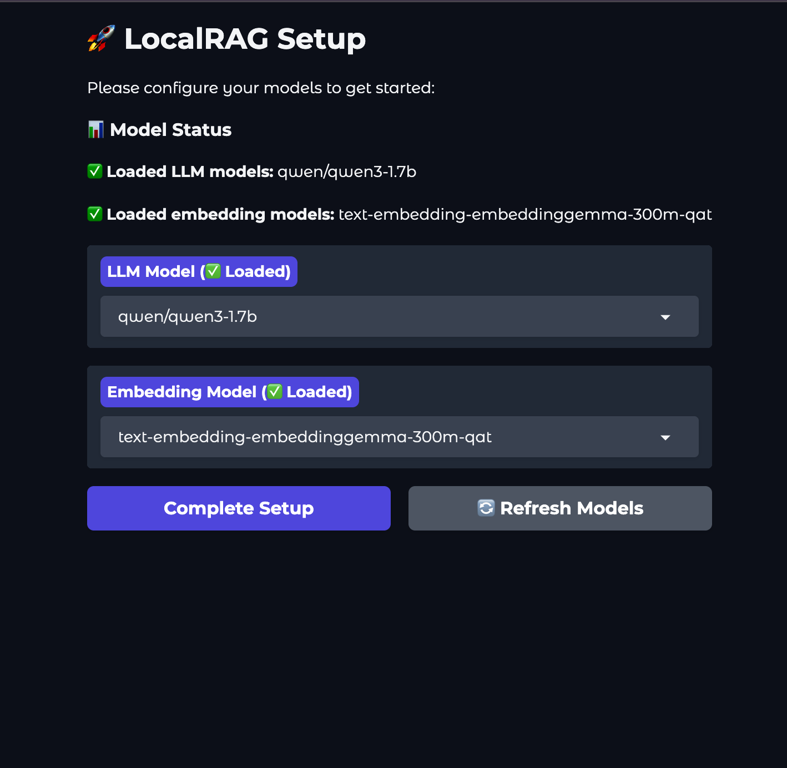
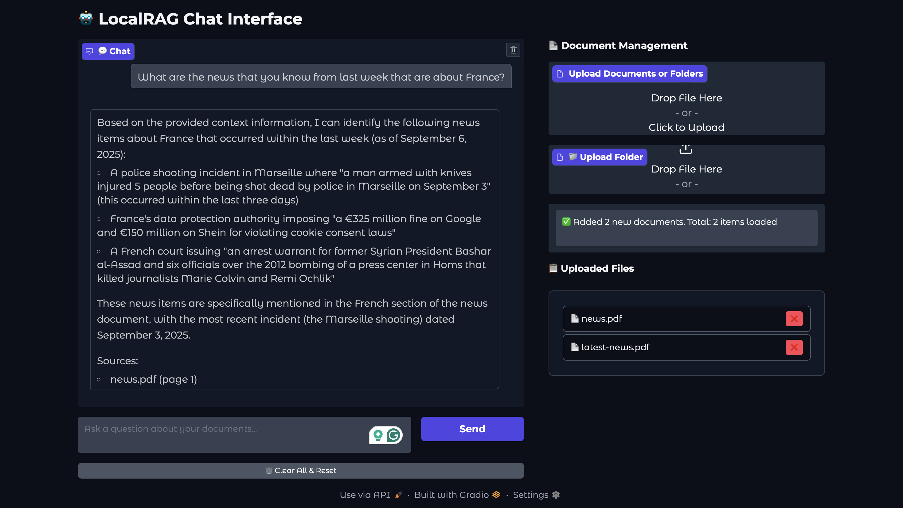

# LocalRAG - Private Document AI Assistant

A simple, privacy-first RAG (Retrieval-Augmented Generation) application that runs entirely on your local machine. Upload your documents and chat with them using local AI models - perfect for sensitive data that never leaves your computer.

**💡 Uses less than 2.5GB of RAM and keeps all your data completely private!**

## Features

- **Local Processing** - No data sent to external servers
- **Multi-format Support** - PDF, TXT, DOCX, MD, CSV files
- **Folder Upload** - Upload entire directories
- **Local AI Models** - Uses LM Studio for LLM and embedding models
- **Chat Interface** - Ask questions about your documents
- **Source Citations** - Shows which documents were referenced

## Requirements

- **Python 3.10+**
- **LM Studio** (for running local AI models)

## Setup Instructions

### 1. Install Dependencies

```bash
git clone https://github.com/Amir-Mohseni/LocalRAG.git
cd LocalRAG
pip install -r requirements.txt
```

### 2. Download AI Models with LM Studio

Download and install [LM Studio](https://lmstudio.ai).

**Search and Download Models:**


1. Open LM Studio
2. Use the search feature to find models
3. Download these recommended models:
   - **LLM**: `qwen/qwen3-4b-thinking-2507` (Quantized Size: ~2.28 GB)
   - **Embedding**: `text-embedding-embeddinggemma-300m-qat` (Quantized Size: ~229 MB)

### 3. Start LM Studio Server

**Configure the Local Server:**


1. Go to the "Local Server" tab in LM Studio
2. Load your downloaded models
3. Start the server (runs on `http://127.0.0.1:1234` by default)

### 4. Run LocalRAG

```bash
python main.py
```

The web interface will automatically start at: `http://127.0.0.1:7860`

### Command Line Options

You can customize the web interface with these options:

```bash
python main.py --port 8080        # Run on a different port
python main.py --host 0.0.0.0     # Allow external connections
python main.py --share            # Create a public sharing link
python main.py --debug            # Enable debug mode
```

**Initial Model Setup:**


When you first start the application or if your models are not loaded, you'll see a setup screen where you need to select your downloaded models before you can begin using the application.

## Using the Application

**Main Interface:**


### Upload Documents
1. **Individual Files**: Drag & drop files or use the file picker
2. **Folders**: Use the folder upload option to upload directories
3. **Supported Formats**: PDF, TXT, DOCX, MD, CSV

### Chat with Your Documents
1. Type your question in the chat box
2. Receive responses with source citations
3. Citations show which documents were referenced

### Example Questions
- "What are the main points in the quarterly report?"
- "Summarize the findings from all research papers"
- "What does the contract say about payment terms?"

## Configuration

The app auto-configures on first run, but you can modify `config.yaml`:

```yaml
api:
  base_url: http://127.0.0.1:1234/v1
models:
  llm:
    model_name: qwen/qwen3-4b-thinking-2507
    context_window: 4096
    num_output: 2048
  embedding:
    model_name: text-embedding-embeddinggemma-300m-qat
```

## Privacy & Security

- All processing happens locally
- No internet connection required after initial setup
- Documents remain on your machine
- Suitable for confidential/sensitive data  

## System Requirements

- **RAM**: 2.5-4GB (depending on model size)
- **Storage**: ~2.5GB for models
- **OS**: Windows, macOS, Linux

## Troubleshooting

**LM Studio not connecting?**
- Ensure LM Studio server is running on port 1234
- Check that models are loaded in LM Studio

**Out of memory?**
- Try smaller models (1B-3B parameters)
- Close other applications

**Slow responses?**
- Use smaller or quantized models or reduce context window in config.yaml

## License

MIT License - Feel free to modify and use for personal/commercial projects.

---

## Getting Started

After completing the setup steps above, you can start uploading documents and asking questions about their content.
